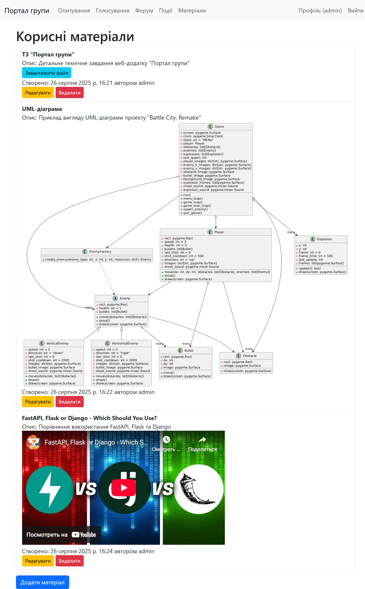

# Group Portal

Welcome to the **Group Portal**, a Django-based web application designed to facilitate community interaction, project management, and resource sharing for a group of users. This project serves as a centralized platform for members to engage in various activities, manage their portfolios, and access shared materials.

## Overview

The Group Portal is built using Django and includes several modular applications to handle different functionalities. It is designed to be scalable and customizable for different community needs.

- **Project Structure**:
  - `group_portal/`: The main Django project directory.
  - `static/`: Contains static files (e.g., images, CSS, JavaScript) with subdirectories for organization.
  - `templates/`: Stores HTML templates with subdirectories for each app.

- **Installed Applications**:
  - `core`: Manages user profiles, group profile, and basic authentication.
  - `forum`: Provides a discussion board for community interaction.
  - `polls`: Handles survey and poll creation and voting.
  - `voting`: Manages voting-related features (distinct from polls).
  - `events`: Organizes and displays group events.
  - `materials`: Stores and shares educational or reference materials.
  - `portfolio`: Allows users to create, edit, and showcase their projects with screenshots, links, and files.

## Features

- **User Management**: Users can register, log in, edit their profiles, and manage avatars.
- **Community Engagement**: Includes forums, polls, voting, and event management.
- **Portfolio Showcase**: Users can add public or private projects with multimedia content.
- **Resource Sharing**: Access to shared materials for all members.

## Installation

1. **Clone the Repository**:
   ```bash
   git clone <your-repository-url>
   cd group_portal
   ```

2. **Set Up a Virtual Environment**:
   ```bash
   python -m venv venv
   source venv/bin/activate  # On Windows: venv\Scripts\activate
   ```

3. **Install Dependencies**:
   ```bash
   pip install -r requirements.txt
   ```

4. **Configure Settings**:
   - Copy `settings.py.example` to `settings.py` (if applicable) and update the database, secret key, and other configurations.
   - Ensure `DEBUG = True` for development.

5. **Apply Migrations**:
   ```bash
   python manage.py migrate
   ```

6. **Create a Superuser**:
   ```bash
   python manage.py createsuperuser
   ```

7. **Run the Server**:
   ```bash
   python manage.py runserver
   ```
   Visit `http://127.0.0.1:8000/` in your browser.

## Screenshots

### Homepage


### User Profile


### Portfolio Page


### Polls Page


### Polls Topic Page


### Voting Page


### Voting Topic Page


### Forum Page


### Forum Topic Page


### Events Page


### Materials Page


## Acknowledgements

- Built with [Django](https://www.djangoproject.com/).
- Thanks to the open-source community for valuable resources and support.

*Last updated: August 28, 2025*